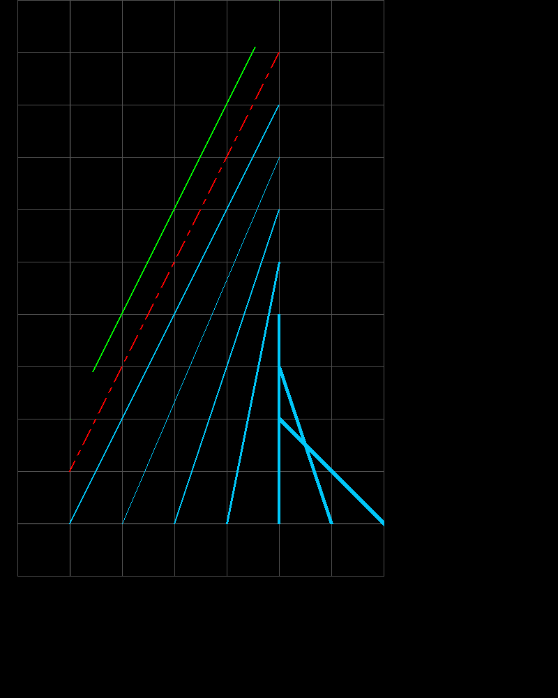
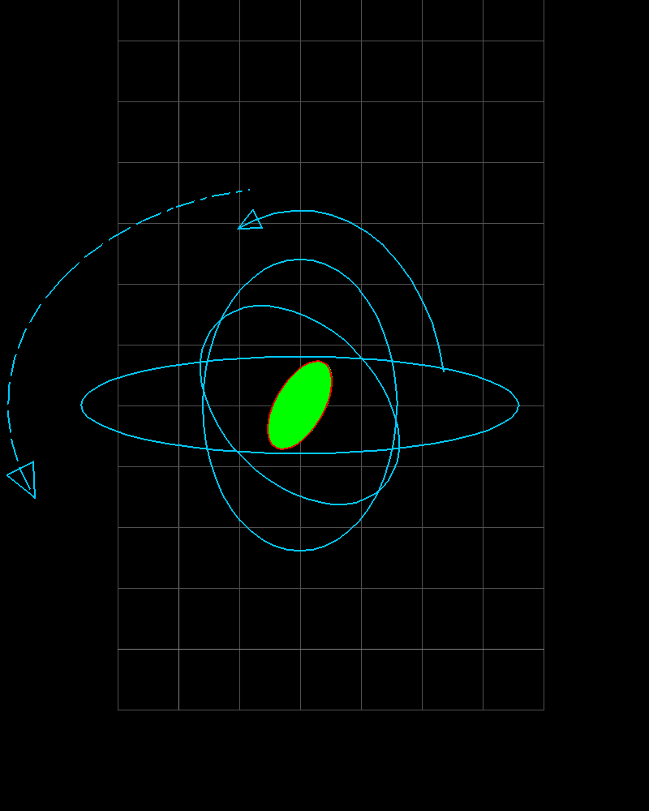
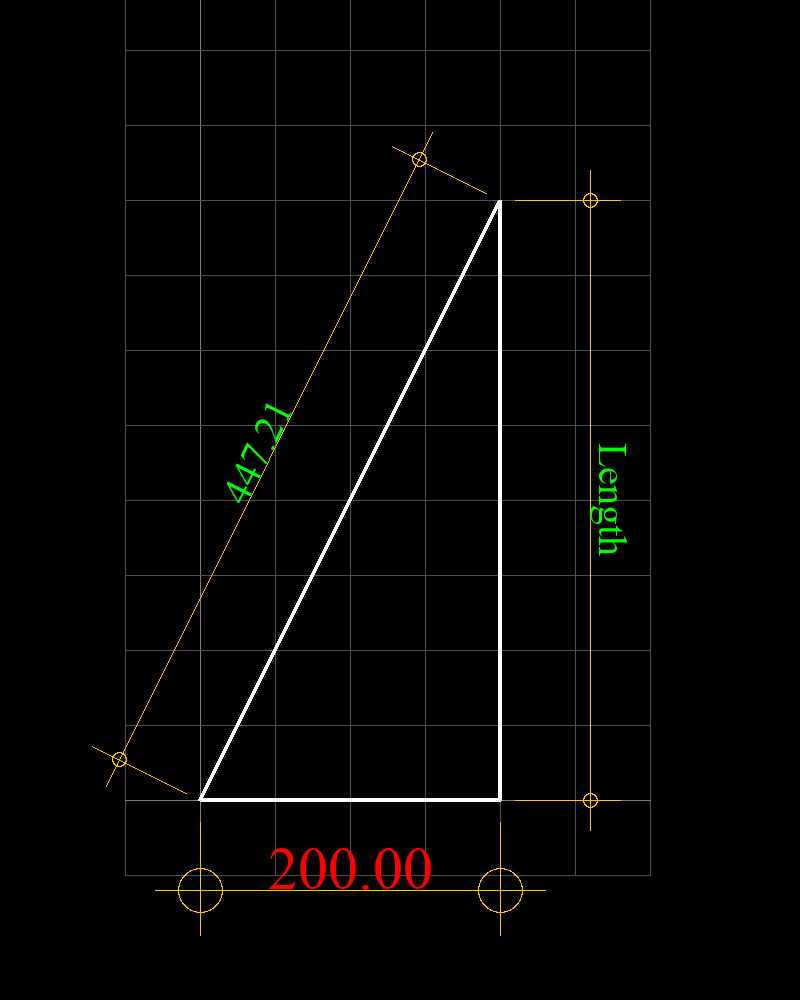
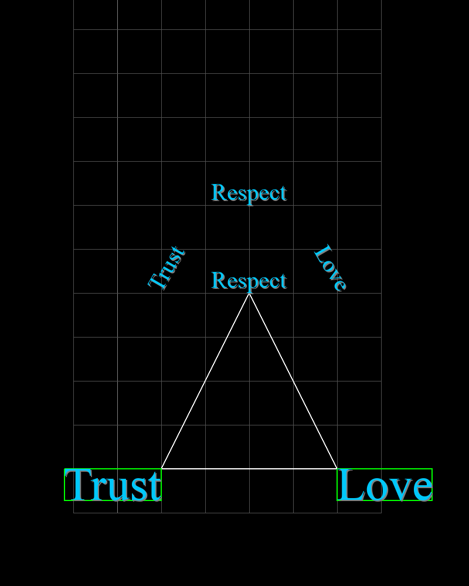
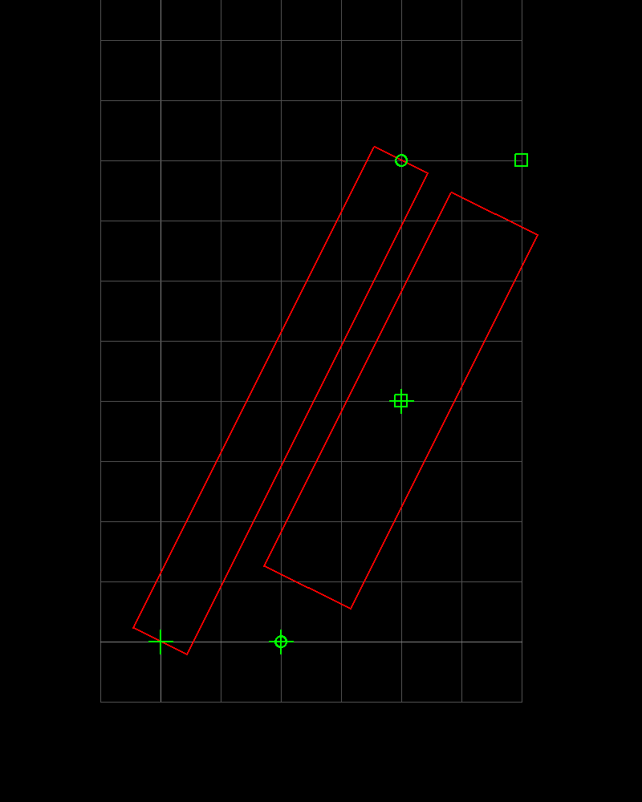

# PHP-CAD2D
CAD2D is a class to create an engineering drawing.
Entity data are stored in the associative array.
Class draw the drawing on image after pre-defined entity data.


## Usage

First include the `cad2d.php` class in your file, and use the class as following to create drawing.

```php
<?php
require_once ("cad2d.php");

$model2d = new CAD2D();
$model2d->setCanvas(200, 800, 1.5);
$model2d->drawGrid(-50, -50, 300, 600, 50);

$fname = "cad2dsample.png";
imagePng($model2d->canvas, './images/'.$fname);
imagedestroy($model2d->canvas);

echo "";
?>
```

## Examples
### Draw Line
[Line drawing example code](example/cadline.php)


### Draw Polylines And Filling Hatch
[Poly Line and Hatch drawing example](example/cadpoly.php)


### Draw Ellipse And Filling Hatch
[Ellipse drawing example](example/cad2dellipse.php)


### Draw Dimension
[Dimension drawing example](example/cad2ddim.php)


### Draw Text
[Text drawing example](example/cad2dtext.php)


### Draw Rectangle And Points
[Rectangle and Point drawing example](example/cad2drectpt.php)


## Contact
Contact me for comercial use via mail winaungcho@gmail.com.

