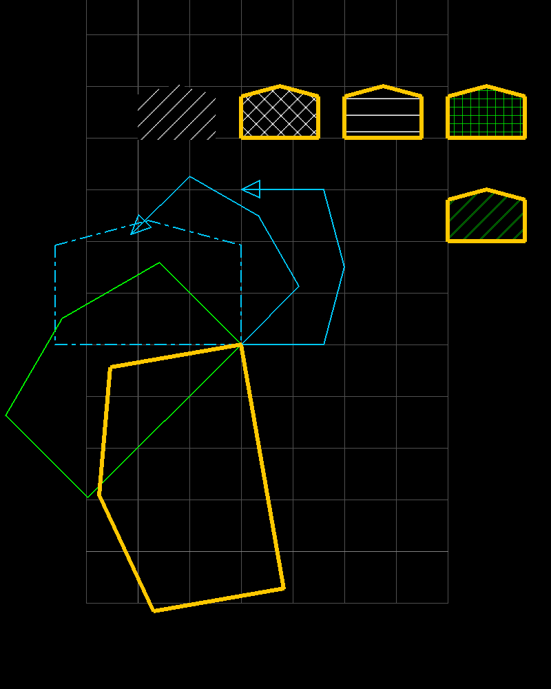

# PHP-CAD2D
CAD2D is a class to create an engineering drawing.
Entity data are stored in the associative array.
Class draw the drawing on image after pre-defined entity data.



## Usage

First include the `cad2d.php` class in your file, and use the class as following to create drawing.

```php
<?php
require_once ("cad2d.php");

$model2d = new CAD2D();
$model2d->setCanvas(200, 800, 1.5);
$model2d->drawGrid(-50, -50, 300, 600, 50);

$fname = "cad2dsample.png";
imagePng($model2d->canvas, './images/'.$fname);
imagedestroy($model2d->canvas);

echo "";
?>
```

## Examples
### Draw Line


### Draw Polylines And Filling Hatch


### Draw Ellipse And Filling Hatch


### Draw Dimension


### Draw Text


### Draw Rectangle And Points
### Draw Dimension


## Contact
Contact me for comercial use via mail winaungcho@gmail.com.

